

# UT1-A1 Documentación y sistema de control de versiones

***Nombre:*** Besay y Javier

***Curso:*** 2º de Ciclo Superior de Desarrollo de Aplicaciones Web.

### ÍNDICE

+ [Introducción](#id1)
+ [Objetivos](#id2)
+ [Material empleado](#id3)
+ [Desarrollo](#id4)
+ [Conclusiones](#id5)

#### ***Introducción***. 

-En esta practica trabajaremos el control de versiones en GitHub.

-Usuario 1: Javier

-Usuario 2: Besay

#### ***Objetivos***. 

-Nuestro objetivo al realizar esta práctica ha sido repasar el funcionamiento del control de versiones, es decir, recordar cómo gestionar cambios sobre diversos elementos a lo largo del tiempo y cómo gestionar distintas versiones del código.

#### ***Material empleado***. 

-Hemos utilizado dos maquinas Debian y la interfaz gráfica de la web de GitHub

#### ***Desarrollo***. 
##### 1. Creación del repositorio
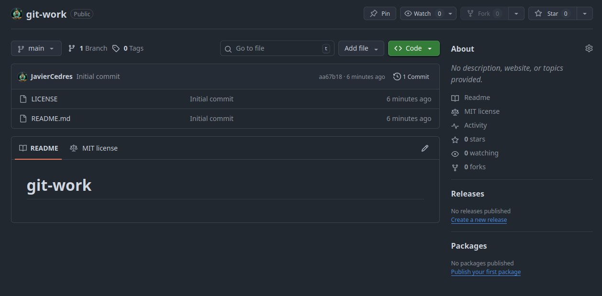</img>

Lo primero que realizamos fue crear un repositorio llamado git-work que tuviese una licencia MIT y un README.md, sobre este repositorio trabajamos durante toda la práctica. 

##### 2. Clonar el repositorio y subir los ficheros correspondientes
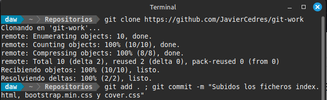</img>

El siguiente paso es que el dueño del repositorio lo clone.

</img>

Luego de clonarlo, se suben los ficheros correspondientes al upstream como se indicaba en el enunciado.

##### 3. Creación Repositorio Fork

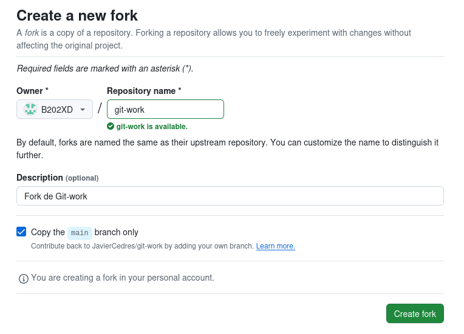</img>

El colaborador debe crear una copia del repositorio original, esto es lo que se conoce como fork.

###### Dificultad encontrada: 
-Se nos ha complicado el entender como funcionaba el fork para hacer que funcionase en local, pero lo hemos resuelto buscando información.

##### 4. Clonación del Repositorio Fork

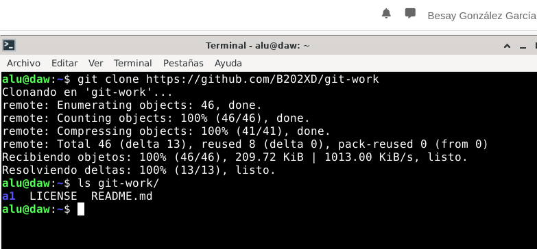</img>

El siguiente paso será clonar el fork a la maquina local para trabajar desde repositorio remoto.

##### 5. Creación del issue "Add custom text for startup contents"
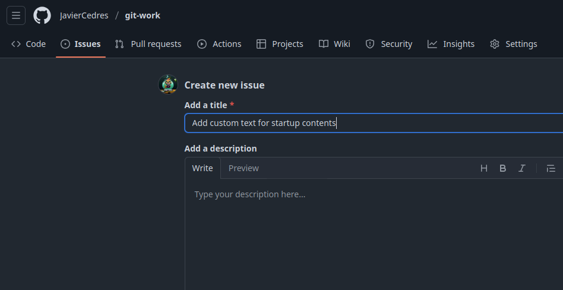</img>

El dueño del repositorio crea un Issue desde GitHub llamado "Add custom text for startup contents".

##### 6. Rama Custom-Text

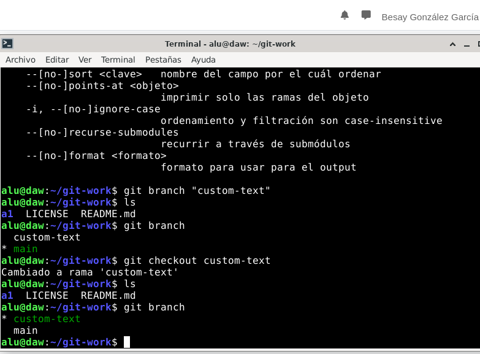</img>

Siguiendo con los pasos que se indican en la imagen se tendrá que crear una nueva rama, luego se posisionará en esta.

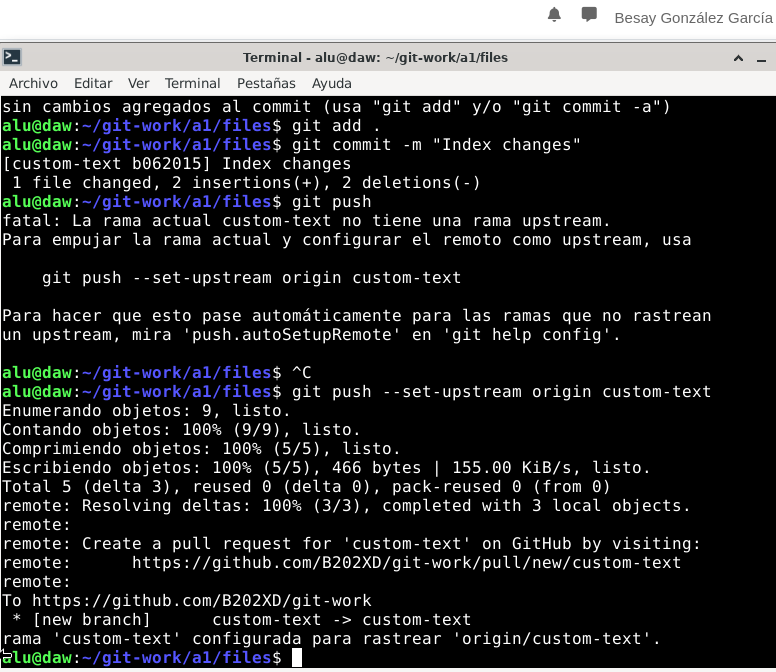</img>

Se personalizará el fichero index.html, una vez modificado se guarda en la rama creada anteriormente.

##### 7. Enviar PR Custom-Text

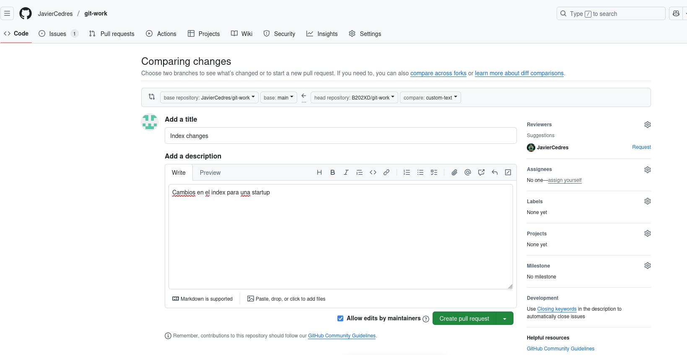</img>

Cuando esté la rama terminada con los cambios requridos se hará un Pull Request indicando los cambios con titulo y una descripción para proporcionar información a los participantes.

</img>

Se envia el Pull Request al repositorio original para que se puedan realizar las pruebas requeridas.

##### 8. Probar el PR, añadir repositorio remoto y subir cambios al PR
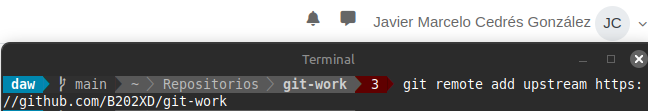</img>

Lo primero que hacemos es crear un repositorio remoto que apunte al fork creado previamente.

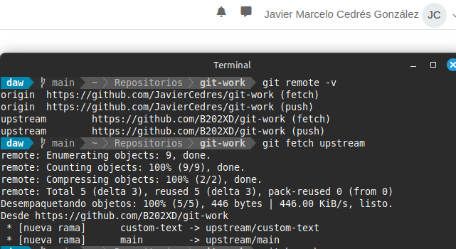</img>

Una vez añadido el repositorio remoto traemos los cambios realizados en este para comprobar que el código del PR funciona correctamente.

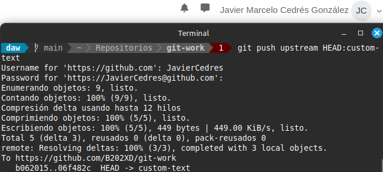</img>

Luego de revisar el PR y añadir los cambios pertinentes subimos los cambios a ese Pull Request.

##### 9. Conversación en el PR y adición de nuevos cambios
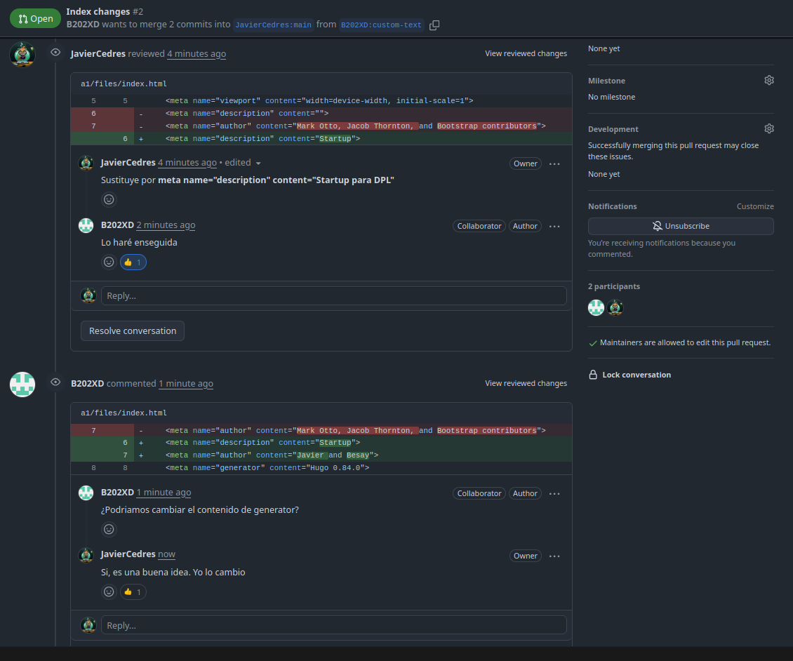</img>

Se añaden varios comentarios en el código sobre cambios a realizar.

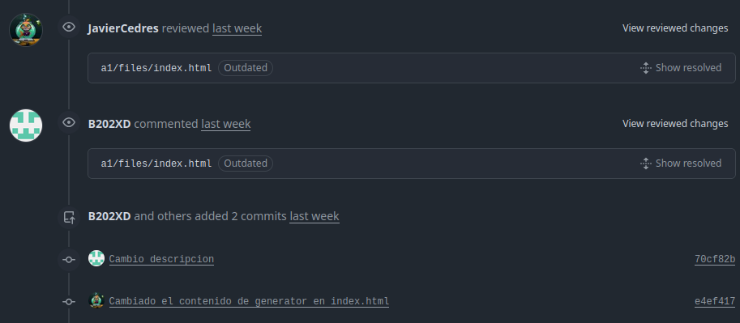</img>

Se suben los cambios necesarios para cumplir con los comentarios anteriores.

##### 10. Aprobar el PR y cerrar el issue
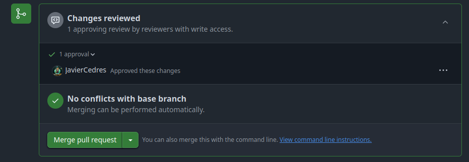</img>

Una vez revisado que el PR no tiene ningún error y cumple con las especificaciones necesarias se aprueba.

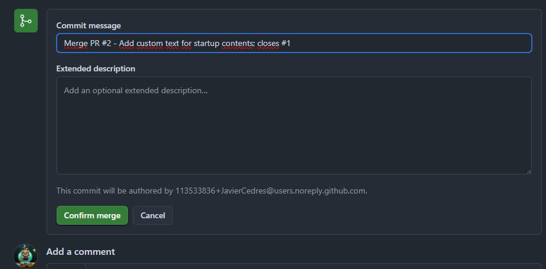</img>

En el momento en el que se aprueba ya podemos hacer un merge para integrar los cambios del PR en la rama especificada en este, en este caso la rama principal. También se cierra el issue relacionado al poner **closes #1**.

##### 11. Incorporar Upstream

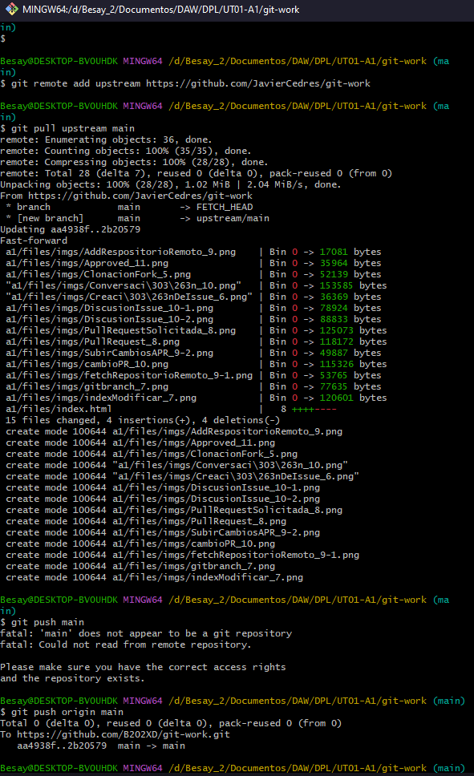</img>

Ahora se tendrá que añadir a la rama principal del fork los cambios realizados del upstream principal, simplemente tenemos que añadirlo como un repositorio remoto.

##### 12. Creación del Issue "Improve UX with cool colors"

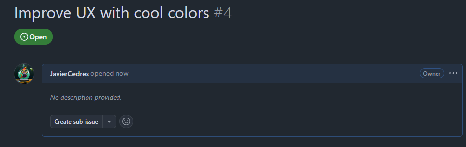</img>

Se crea un Issue llamado "Improve UX with cool colors".

##### 13. Cambiar el fichero cover.css

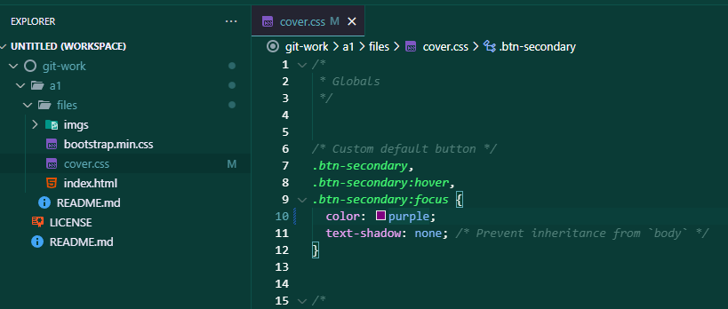</img>

Al igual que se indica en la práctica se cambia el fichero cover.css

##### 14. Subir cambios sin hacer push
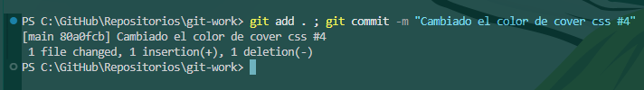</img>

Se suben los cambios al staging area y se hace un commit pero sin hacer push

##### 15. Rama Cool-Colors

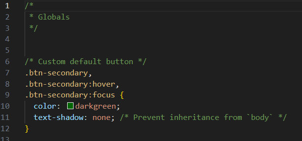</img>

Para esta parte habrá que volver a crear otra rama, pero esta vez cambiando la misma línea que se había modificado en el paso anterior.

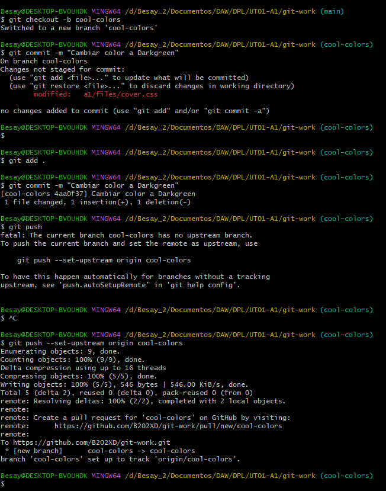</img>

Actualizamos los cambios a la rama mediante el repositorio remoto.

##### 16. Enviar PR Cool-Colors

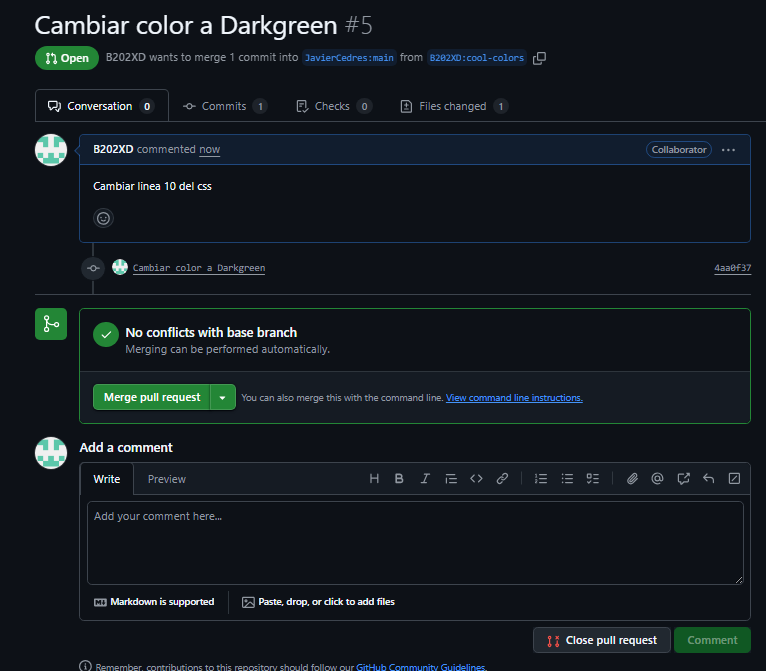</img>

Se vuelve a enviar otro PR para que se puedan verificar los cambios.

##### 17. Se prueban los cambios del nuevo PR y se arreglan los conflictos

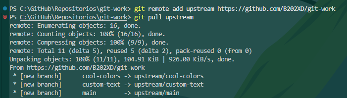</img>

Anteriormente añadimos un repositorio remoto para poder ver en local los cambios realizados en el PR, en esta ocasión no sería necesario volver a hacerlo, pero en nuestro caso este paso lo realizamos desde una máquina distinta por ello tuvimos que volver a añadirlo. Una vez lo tenemos añadido nos traemos los cambios a local.

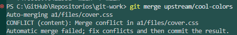</img>

Al intentar traernos los cambios podemos ver que se nos advierte de que hay conflictos que debemos resolver para poder subir los cambios.

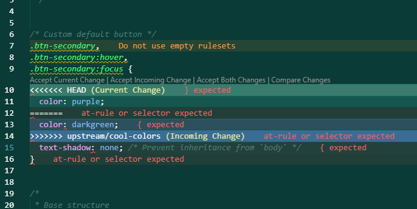</img>

Gracias a Visual Studio Code los conflictos se pueden arreglar fácilmente, solo debemos seleccionar en la parte superior de cada conflicto con qué cambio queremos quedarnos. En nuestro caso queremos los cambios realizados por el usuario que envía el PR, por tanto nos quedamos con **Incoming Change**

##### 18. Modificar text-shadow
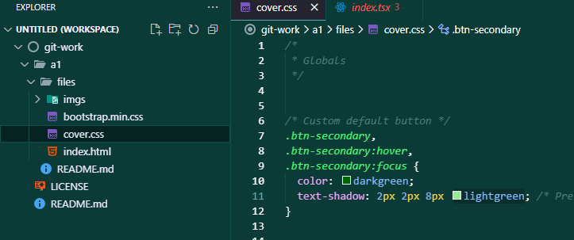</img>

Una vez arreglado el conflicto, cambiamos el text-shadow en cover.css

##### 19. Subir cambios en el cover.css y cerrar el Issue relacionado 
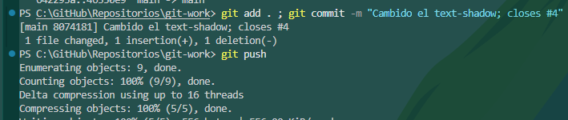</img>

Subimos los cambios realizados y cerramos el Issue relacionado utilizando **closes #4**

##### 20. Crear tag y release
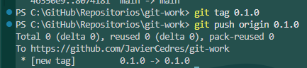</img>

Al terminar de realizar todos los cambios necesarios etiquetaremos la versión actual de la aplicación como 0.1.0 y la subiremos a Github

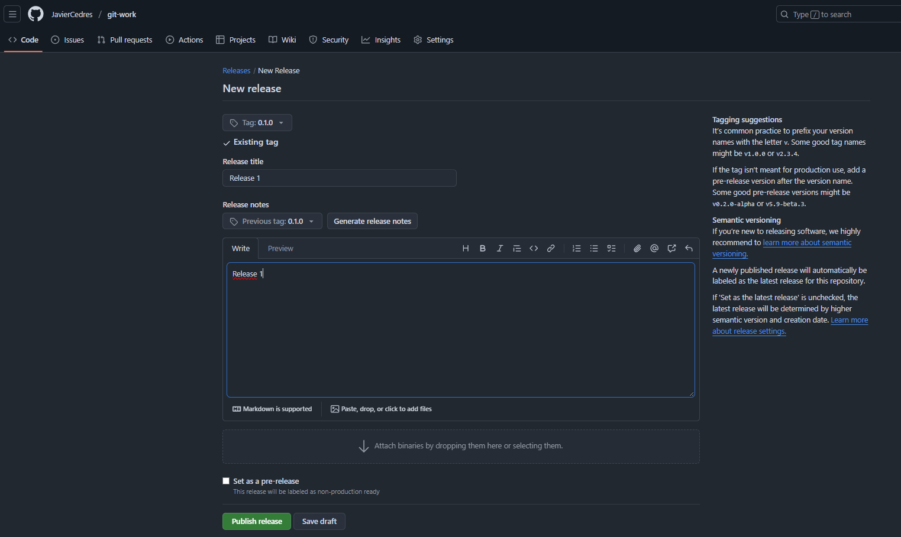</img>

Por último crearemos una release utilizando la etiqueta creada previamente

> ***IMPORTANTE:*** si estamos capturando una terminal no hace falta capturar todo el escritorio y es importante que se vea el nombre de usuario.

Si encontramos dificultades a la hora de realizar algún paso debemos explicar esas dificultades, que pasos hemos seguido para resolverla y los resultados obtenidos.

#### ***Conclusiones***. 

En esta parte debemos exponer las conclusiones que sacamos del desarrollo de la prácica.
